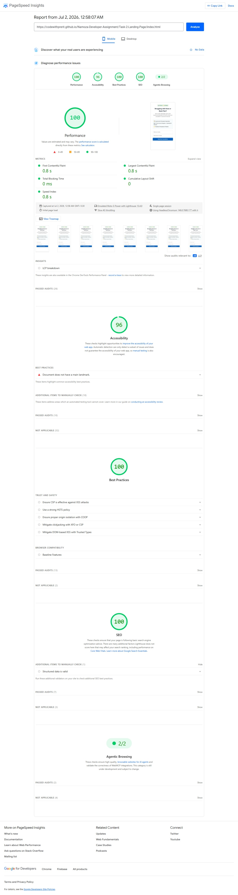

[](https://codewithprerit.github.io/Namoza-Developer-Assignment/Task-2-Landing-Page/)

[](https://github.com/codewithPrerit/Namoza-Developer-Assignment)


# 🚀 Namoza Developer Assignment

A complete submission for the **Namoza Developer Assignment**, demonstrating front-end development, Google Tag Manager (GTM) event tracking, and CRM integration design for a healthcare consultation landing page.

---

## 👨‍💻 Candidate Information

**Name:** Prerit Bharadwaj

**GitHub:** https://github.com/codewithPrerit

---

# 📌 Assignment Overview

This repository contains solutions for all three tasks of the Namoza Developer Assignment.

| Task | Description | Status |
|------|-------------|--------|
| Task 1 | GTM Event Schema | ✅ Completed |
| Task 2 | Responsive Consultation Landing Page | ✅ Completed |
| Task 3 | Integration Design (HubSpot + Karix + GA4) | ✅ Completed |

---

# 📂 Project Structure

```
Namoza-Developer-Assignment
│
├── README.md
│
├── Task-1-GTM-Event-Schema
│   └── schema.md
│
├── Task-2-Landing-Page
│   ├── index.html
│   └── pagespeed-mobile.jpeg
│
└── Task-3-Integration-Design
    └── integration.md
```

---

# ✅ Task 1 – GTM Event Schema

Designed a complete Google Tag Manager event specification for consultation form submissions.

### Deliverables

- GTM Event Name
- dataLayer Schema
- Event Parameters
- GA4 Mapping
- Google Ads Conversion Mapping
- Documentation

---

# ✅ Task 2 – Consultation Landing Page

Developed a responsive healthcare landing page using only HTML, CSS, and Vanilla JavaScript.

### Features

- 📱 Mobile Responsive
- 🎯 Google Tag Manager dataLayer Event
- ✅ Client-side Form Validation
- 🚫 No Page Reload
- 🎉 Thank You State
- ⚡ Lightweight & Fast Loading
- ♿ Semantic HTML
- 🔍 SEO-friendly Meta Tags

---

## 🌐 Live Demo

👉 **Live Landing Page:**  
🔗 [https://codewithprerit.github.io/Namoza-Developer-Assignment/Task-2-Landing-Page/](https://codewithprerit.github.io/Namoza-Developer-Assignment/Task-2-Landing-Page/)

---

## 📊 PageSpeed Insights

Mobile PageSpeed report used during optimization.



---

# ✅ Task 3 – Integration Design

Designed a production-ready integration architecture connecting the landing page with:

- HubSpot CRM API
- Karix WhatsApp Business API
- Google Analytics 4 (GA4)
- Google Ads Conversion Tracking

### Covered Topics

- End-to-End Architecture
- Contact Creation & Update
- Phone Number Deduplication
- Failure Handling
- Retry Mechanism
- SLA Monitoring
- WhatsApp Delivery Workflow

---

# 🛠 Tech Stack

- HTML5
- CSS3
- JavaScript (ES6)
- Google Tag Manager
- Google Analytics 4
- HubSpot CRM API
- Karix WhatsApp Business API
- Git
- GitHub

---

# 📷 Repository Preview

This repository contains:

- ✔️ GTM Event Documentation
- ✔️ Responsive Landing Page
- ✔️ CRM Integration Design
- ✔️ PageSpeed Report
- ✔️ GitHub Pages Deployment

---

## 📂 GitHub Repository

🔗 [https://github.com/codewithPrerit/Namoza-Developer-Assignment](https://github.com/codewithPrerit/Namoza-Developer-Assignment)

---

# 🙏 Thank You

Thank you for reviewing my assignment.

I appreciate your time and consideration.

Looking forward to discussing my submission further.

---

⭐ **Submitted by Prerit Bharadwaj**